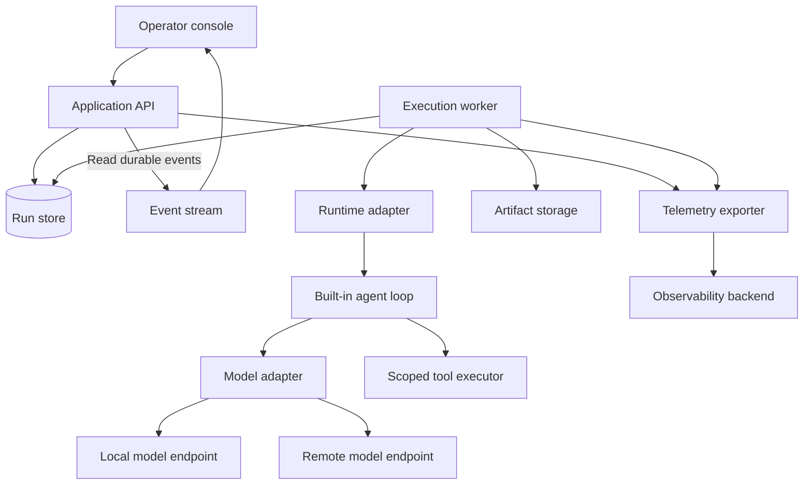

# Architecture

Status: Draft for review

Date: 2026-09-20

## Objectives

Provide a local development environment for comparing how agents accomplish tasks. Support local and remote inference from the first release, make execution inspectable, and add long-running coordination incrementally.

The principal unit is a **run**: a versioned task definition, input, effective configuration, execution history, and outcome. A conversation supplies input to a run; it does not define the run's identity or own its lifecycle.

Initial use assumes one trusted operator on one machine. Hosted multi-user operation, arbitrary third-party plugins, public ingress, visual workflow authoring, and automatic self-modification are outside the initial scope.

## Architectural approaches

| Approach | Strength | Tradeoff |
|---|---|---|
| Small application with a built-in loop and explicit adapter boundaries | Direct control over experiments and limited initial dependencies | Own the bounded loop and honest failure semantics |
| LangGraph as the execution foundation | Stateful graphs and persistence are central abstractions | Selects orchestration semantics before graph requirements are proven |
| Temporal as the execution foundation | Durable execution, waits, and worker coordination | Adds a service and workflow programming constraints to the first experiment |

Recommend the first approach for phase 1. Evaluate the latter two before implementing recovery in phase 2. Do not gradually build a distributed workflow engine by accident. See [ADR 0001](../adr/0001-modular-application.md).

## Components

These are module boundaries, not separate services. Start with one application process hosting an HTTP interface and one execution worker. Keep request handling separate from run execution so closing a browser does not stop a run. The database and telemetry services may run separately.

| Module | Owns | Does not own |
|---|---|---|
| Operator interface | Run list/detail, configuration forms, commands, event display | Execution decisions |
| Application service | Validation, run creation, command acceptance, query API | Provider-specific request formats |
| Run store | State, configuration revisions, ordered events, attempts | Model context policy |
| Execution worker | Claiming work, lifecycle transitions, limits | UI sessions |
| Runtime adapter | Executing an agent or workflow and reporting lifecycle support | Choosing global defaults |
| Model adapter | Request/response normalization, capability declarations, usage | Tool execution or run scheduling |
| Tool executor | Input validation, scope enforcement, result capture | Agent planning |
| Telemetry | Traces, metrics, structured logs | Authoritative run state |

## Model endpoints and agent runtimes

A **model profile** identifies an adapter, endpoint, model, credential reference, capability declaration, and generation parameters. Local/remote is placement metadata; it is not a protocol. An OpenAI-compatible endpoint may be local or remote and may implement only a subset of the protocol.

A **runtime profile** identifies who owns the agent loop. Phase 1 implements a built-in loop. Later adapters may execute a packaged coding agent or graph engine. Such a runtime may manage its own model selection, tools, context, and sessions. It must declare those constraints rather than pretending all runtime/model combinations work.

Initial logical contracts, independent of language:

| Contract | Input | Output |
|---|---|---|
| Model invocation | Messages, tool schemas, selected profile revision, output limit, deadline | Assistant content/tool requests, completion reason, usage if available, normalized error |
| Runtime execution | Run specification, checkpoint if supported, execution context | Ordered lifecycle/activity events and explicit terminal outcome |
| Tool invocation | Validated arguments, run scope, invocation ID, deadline | Typed result or error, artifact references |
| Run command | Run ID, command ID, expected state/config version, payload | Accepted/rejected result; application acknowledgment is a later event |

Capabilities include tools, structured output, streaming, context capacity, usage reporting, cancellation, and resume. Capabilities are configured and tested for the actual adapter/model combination. A missing requirement rejects a run before it is queued. Do not silently replace a local endpoint with a remote one.

External-runtime adapters are a future implementation, not required scaffolding for phase 1. The separation is documented now to avoid conflating the contracts. See [ADR 0002](../adr/0002-model-runtime-boundaries.md).

## Durable data

Use a transactional relational store for mutable state and ordered history. The proposed stack uses PostgreSQL for transactions, constraints, and later worker coordination. Use the same database engine in integration tests. SQLite is an alternative for a strictly single-process tool, but is not the recommended baseline. See [ADR 0005](../adr/0005-typescript-postgresql-stack.md).

| Record | Essential information |
|---|---|
| Definition | ID, immutable version/digest, entry point, required capabilities, input/output schemas |
| Profile revision | Adapter/runtime identity, endpoint metadata, settings, credential reference |
| Run | ID, definition version, input/artifact references, status, state version, parent/retry reference, timestamps |
| Run configuration revision | Immutable effective configuration, revision, scope, effective event sequence |
| Attempt | Run ID, attempt ID, owner, timestamps, outcome |
| Run event | Run ID, monotonically increasing sequence, type, attempt/step IDs, timestamp, configuration revision, structured payload |
| Model/tool invocation | Invocation ID, attempt, start/end status, normalized error, usage metadata |
| Artifact | ID, run association, type, digest, storage location |
| Operator command | Command ID, run ID, type, payload, expected version, accepted/applied/rejected status |

Phase 1 needs only start/cancel commands. Durable conversational commands, checkpoints, and leases are phase 2 additions. Experiment groups and task queues are phase 4 additions.

State transition and corresponding event commit in one transaction. Append-only history describes semantic events; token deltas may be ephemeral and are not checkpoints. The UI reconstructs durable history after reconnecting using the last event sequence. Full event sourcing is not required: the run row is authoritative current state, with an audit history written atomically alongside it.

Artifact files are written to a temporary location, finalized atomically, and then referenced in a database transaction. An unreferenced file after a failed commit is recoverable garbage; do not publish a record pointing to an unfinished artifact. Begin with small final outputs in the database where practical.

## Lifecycle and interruption

Phase 1 states: `queued`, `running`, `cancel_requested`, `succeeded`, `failed`, `cancelled`, `interrupted`.

- Creation commits a queued run and event before reporting success.
- One worker claims queued work transactionally and creates an attempt.
- Only the current attempt may commit execution results.
- The loop checks cancellation and limits before each model/tool call and before terminal completion.
- A terminal transition compares the current state/version. If cancellation was accepted first, a late success cannot overwrite it; an already-terminal run rejects cancellation.
- Cancellation requests abort an in-flight call where supported. No further calls start. The run becomes cancelled after local execution stops; provider-side work or billing may continue if the provider cannot abort.
- A failed verifier produces `failed`, with a reason distinct from provider or tool failure.
- Startup marks runs left running/cancelling by the former process as interrupted. Queued work remains queued. Phase 1 enforces one application instance per data store with a session advisory lock held on a dedicated PostgreSQL connection. Lock loss stops execution; the worker must not continue without storage ownership. It does not reclaim another live process's work.
- Phase 1 retries create a new linked run. They never claim to resume interrupted execution.

Phase 2 adds `pause_requested`, `paused`, `waiting_for_input`, checkpoints, durable commands, and lease/fencing rules. Pause takes effect at a safe step boundary. A checkpoint identifies definition version, configuration revision, context, completed step results, and next action. Resume must verify compatibility. Remote side effects need idempotency or reconciliation before retry; a checkpoint alone cannot guarantee exactly-once effects.

## Configuration and communication

Resolution order: application defaults → selected definition/profile settings → explicit run overrides. Persist the resolved configuration at creation, including version references, excluding secret values.

Changing defaults affects only future runs. Phase 1 running configurations are immutable. Phase 2 permits explicit run-level changes at a safe boundary with optimistic concurrency and an applied acknowledgment. The supported initial changes are instructions and remaining limits; model/runtime switches require pause and compatibility checks or a new run. Lowering a limit below current usage stops further work at the next boundary.

Operator messages are immutable commands. The worker records when each message enters the context, enabling the UI to distinguish delivered from applied. A message arriving during a model request does not rewrite that request retroactively. See [ADR 0003](../adr/0003-durable-run-state.md).

## Observability

Use OpenTelemetry-compatible tracing, structured logs, and metrics. Record HTTP requests, queue wait, run attempts, model invocations, tool invocations, database operations, and exporter failures. Long runs use bounded spans per attempt/step with correlation IDs rather than one indefinitely open span.

Run/attempt/step IDs link history to telemetry. Include IDs in traces and logs, not metric labels. Metric labels use bounded dimensions such as adapter, configured profile, outcome, and operation. Track duration, error counts, queued/active runs, missing usage, token counts where provided, and cancellation latency.

Unknown token usage or cost is explicitly unknown, never zero. Cost estimates reference a price configuration and its date; local CPU/GPU measurements are separate and only reported if actually collected. Phase 1 does not require GPU instrumentation.

The run database remains usable when telemetry export fails. Export buffering is bounded and failures are visible. Diagnostic exports omit prompts, tool arguments/results, credentials, and sensitive endpoint query strings by default. Payloads needed for the operator's run history remain local under a documented retention policy. See [ADR 0004](../adr/0004-observability-boundary.md).

## Tool and deployment boundaries

Phase 1 uses fixture-reading and pure computation tools. It does not expose arbitrary shell commands, write access to repositories, or messaging side effects. Enforce the allowlist and fixture scope in code, not prompts. Validate arguments before invocation and reject unexpected tool names.

Bind the initial operator service to loopback. Browser mutation requests require same-origin checks and CSRF protection; do not enable permissive CORS. Remote deployment requires a separate specification for authentication, authorization, transport, and workspace isolation. Model credentials are loaded through named secret references and never returned through configuration APIs.

Recommended stack: TypeScript on Node.js, Fastify, React with Vite, PostgreSQL with Drizzle, Vitest and Playwright, and OpenTelemetry with a local Grafana LGTM development stack. Use Docker Compose for dependencies and run the application locally during development. The stack is proposed in [ADR 0005](../adr/0005-typescript-postgresql-stack.md); detailed responsibilities and alternatives are in the [stack specification](implementation-stack.md). No application code has been scaffolded.

## Validation and architectural review gates

Phase 1 acceptance is defined in the [observable loop specification](phase-1-observable-loop.md). Before phase 2, compare an adopted durable execution engine against the cost of implementing checkpoint recovery and command delivery. Before phase 3, prove graph semantics including bounded cycles, joins, and failure propagation. Before phase 4, prove isolated worker ownership and independent evaluation.

External sources and local implementation evidence are cataloged in [reference research](reference-research.md).
